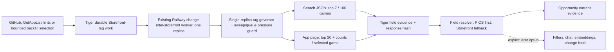

# Public Steam Tag Ingestion Research

**Date:** 2026-07-31

**Status:** Approved implementation; five-app production canary passed and fetch lane returned to disabled
**Primary reproduction:** Steam app `5005180`, opportunity result `295997b1-e728-4ede-b26c-a525c5ccd7b4`

## Decision

Use a hybrid queue architecture:

1. Keep GitHub Actions as the bounded control plane that discovers or seeds work.
2. Perform public Steam Store tag fetches in the existing single-replica Railway Storefront queue worker, under a burst-one tag governor that defers to actual Storefront sweep and queue pressure.
3. Start with the public app page for games that need the full top-20 tag profile, especially PICS-token-blocked, opportunity-relevant, newly discovered, and explicitly requested games.
4. Treat Steam's public search response as a later breadth optimization: it returned 100 games per request in testing, with seven ranked tag IDs per game, but its pagination and completeness have not passed a canary.
5. Keep PICS as the preferred tag source when it succeeds. Treat public Storefront tags as an official-current fallback, not as proof that PICS is ready and not as a byte-for-byte substitute for PICS.

Do **not** add an app-page request to every item in the existing six-way GitHub Storefront matrix. Do **not** create another independently governed Railway scraper. Both choices would increase uncoordinated traffic to `store.steampowered.com` and put existing metadata features at risk.

This is a technical recommendation, not legal clearance for automated commercial collection. Valve documents Web API use, but it does not document the Store search JSON or app-page HTML as supported ingestion APIs. PublisherIQ should confirm the intended use with Valve/Steamworks or counsel before a catalog-scale rollout.

## Approved first rollout

- Fetch one app page at a time; the app endpoint has no supported multi-app batch form.
- Batch Tiger queue claims and evidence writes so normal work uses one claim and one evidence upsert per small group rather than one database round trip per tag.
- Run the first five requests at one request per 10 seconds with no HTTP retries.
- If that canary is clean, use one request per 5 seconds for steady targeted work, burst 1, with a starting cap of 500 actual attempts per UTC day.
- While a GitHub Storefront sweep is scheduled or recorded as running in Tiger, admit only priority `>= 900` work and slow it to one request per 10 seconds. `/opportunities` fills rank above this threshold; genuinely new games and demos sit at the threshold; launch-window and old backlog work wait.
- Keep search-page batching disabled until coverage, duplicate, ordering, and deep-pagination tests pass.

The 10-second setting is a canary brake, not the recommended permanent throughput. Database batching saves Tiger load; it does not make Steam's one-app HTML endpoint into a supported HTTP batch API.

## Production canary result

The approved production canary ran on 2026-07-31 from `21:12:05Z` through `21:12:45Z` while three recent GitHub Storefront sync jobs were recorded as running. The overlap guard therefore admitted only the five priority-900+ canary rows and used the 10-second limiter.

| Priority | App ID    | Result                                                              |
| -------: | --------- | ------------------------------------------------------------------- |
|     1200 | `5005180` | 20 known tags; first tag `Action Roguelike`                         |
|     1100 | `4801180` | 19 known tags; first tag `Strategy`                                 |
|     1050 | `3091140` | 20 known tags; first tag `Strategy`                                 |
|     1000 | `5018320` | Nine known tags; first tag `Racing`                                 |
|      950 | `4166920` | Negative control failed closed because no `InitAppTagModal` existed |

The sync record reported exactly five actual attempts, four successes, one expected failure, four evidence changes, and zero HTTP retries. Successful completion timestamps were approximately 10 seconds apart. The inaccessible control wrote no false empty evidence and conservatively opened the parser circuit.

The live opportunity rule-input resolver returned each successful tag field as `known`, source `steam_storefront`, with its observation time and complete ordered value. PICS remains preferred whenever known. No canonical tag relationships, embeddings, filters, historical opportunity results, or change events were updated.

Observed load remained small:

- The four new evidence function calls averaged `1.775 ms`, read one shared database block in total, wrote no temporary blocks, and returned four changed rows.
- The priority claim function averaged `0.479 ms` across the worker's tag and existing queue polls.
- Tiger connections were 18 before and 17 after; active connections were three before and two after. The canary produced no visible connection or activity increase.
- The Railway worker peaked at `0.063 vCPU` against an 8-vCPU allocation and 136 MB against an 8,192-MB allocation during startup and the run.

After measurement, `STOREFRONT_TAGS_ENABLED` was restored to `false` and `QUEUE_SOURCES` was restored to `storefront,projection_refresh`. The four source-aware evidence rows remain live; the worker cannot issue more tag requests until a deliberate steady-state enablement.

Post-canary hardening also reserves the entire claimed batch against the daily budget before requests begin, preventing a worker crash from replaying past the cap. The overlap guard now considers active/recent GitHub sweep records, Storefront queue age, and Storefront queue depth in one cached indexed check per minute.

The live `EXPLAIN ANALYZE` for that combined pressure check completed in `0.985 ms`, used index scans, performed zero shared-block reads, and wrote nothing. At one check per minute only while the tag feature is enabled, this is an intentionally negligible Tiger cost.

## Intentional limits before broad rollout

- The implemented governor is authoritative for tag requests in the one Railway replica, but it is not a distributed token bucket for all six GitHub Storefront partitions. Coordination is pressure-based. Migrating those partitions into the durable queue remains the cleanest long-term route to one truly global budget.
- Successful canary HTML was reduced to extracted evidence plus a response hash; raw HTML was not archived to R2. Before parser-risk grows, archive parser failures and a bounded success sample through the existing R2 archive path.
- Search-page batching remains research-only. It must not write evidence until deep pagination, gaps, duplicates, app-type coverage, and ordering are verified.
- The opportunity worker and query API code are deployed, but their Storefront-tag producer flag remains off. The new/demo hint producer exists in the worktree and will not run in scheduled GitHub workflows until this branch is reviewed and merged.
- Canonical tag edges and downstream filters/chat/embeddings/change events intentionally remain unchanged.

## ELI5

Steam has several doors into the same shop:

- PICS is a stockroom door. It usually gives excellent structured data, but some games require a pass that Steam does not hand to anonymous clients.
- `api/appdetails` is a public information desk. It gives genres, categories, languages, and platforms, but not user tags.
- The public Store page is the shelf label customers see. It contains the tags even when the stockroom door is locked.

For app `5005180`, PublisherIQ checked the stockroom door, was told a token was required, and then stopped. It already used the information desk for genres and categories, but it never read the shelf label for tags. The recommended worker adds that shelf-label path carefully and slowly; it does not pretend the stockroom door opened.

## What the reproduction proves

On 2026-07-31, the public Steam surfaces for app `5005180` returned:

| Surface             | Result                                                                                                                                                 |
| ------------------- | ------------------------------------------------------------------------------------------------------------------------------------------------------ |
| PICS                | Durable state remains `source_blocked` / `missing_access_token`.                                                                                       |
| `api/appdetails`    | Three genres, 13 categories, four languages, and Windows support; no user-tag field.                                                                   |
| Store search result | Seven ranked tag IDs: Action Roguelike, Strategy, Card Battler, Turn-Based Tactics, Roguelite, Turn-Based Strategy, Board Game.                        |
| Public app page     | A 20-item ranked tag array with vote counts. The first four were Action Roguelike (55), Strategy (52), Card Battler (49), and Turn-Based Tactics (46). |

The public page returned `200 OK` with `Cache-Control: no-cache` and no useful `ETag` or `Last-Modified` header in the observed response. That means a conditional-GET design cannot be assumed to save requests.

The current `robots.txt` does not disallow `/app/` or `/search/`. That is useful operational evidence, but `robots.txt` is not a license or an API stability promise.

## Source research

### Valve-documented surfaces

Valve's documented [`IStoreService/GetAppList`](https://partner.steamgames.com/doc/webapi/IStoreService) returns catalog entries, `last_modified`, and `price_change_number`. It is a strong, low-request source for deciding _which_ games may need refreshing. It does not return per-app tags.

Valve's [Steam Tags documentation](https://partner.steamgames.com/doc/store/tags?l=english) says that developers, players, and moderators can apply tags; only the top 20 are visible and used for Store visibility. Tag order can change as users apply tags. This supports storing rank, observation time, and source instead of treating tags as permanent attributes.

Valve's [Web API overview](https://partner.steamgames.com/doc/webapi_overview?l=english&language=english) distinguishes public and protected HTTP APIs and recommends the partner host for secure publisher-server calls. The [`IStoreService` reference](https://partner.steamgames.com/doc/webapi/IStoreService) currently documents only `GetAppList`; it does not document a per-app tag method.

Valve's [Web API Terms of Use](https://steamcommunity.com/dev/apiterms) state a 100,000-call-per-day limit for the Steam Web API and prohibit degrading Steam's operation. That published quota applies to the documented Web API. It should not be assumed to authorize or rate-limit Store HTML/search requests.

### Public Store surfaces observed

| Surface                                                                                                                                                         | What it provides                                                          |                    Request efficiency | Contract risk                                                     | Recommended use                                                   |
| --------------------------------------------------------------------------------------------------------------------------------------------------------------- | ------------------------------------------------------------------------- | ------------------------------------: | ----------------------------------------------------------------- | ----------------------------------------------------------------- |
| [`tagdata/populartags/english`](https://store.steampowered.com/tagdata/populartags/english)                                                                     | Tag-ID-to-English-name dictionary                                         |        One request for the vocabulary | Undocumented                                                      | Refresh the dictionary infrequently. It has no app relationships. |
| [Store search JSON](https://store.steampowered.com/search/results/?query&start=0&count=100&dynamic_data=&sort_by=_ASC&category1=998&infinite=1&cc=us&l=english) | App IDs and seven ranked tag IDs per search result                        |          100 games per tested request | Undocumented; ordering, deep pagination, and fields can change    | Broad bootstrap and low-confidence/current top-seven evidence.    |
| [App `5005180` Store page](https://store.steampowered.com/app/5005180/?l=english&cc=us)                                                                         | Up to 20 ranked tags and observed vote counts inside `InitAppTagModal`    |                  One game per request | Undocumented HTML/JavaScript structure; response is not cacheable | Targeted full-profile fill and refresh.                           |
| [`api/appdetails`](https://store.steampowered.com/api/appdetails/?appids=5005180&cc=us)                                                                         | Genres, categories, languages, platforms, media, and other Store metadata | One game per current PublisherIQ call | Undocumented endpoint; already in production use                  | Continue for non-tag Storefront evidence.                         |

The Store search observation is especially useful. Its response carried `data-ds-tagids` for 100 games in one request. For `5005180`, it returned the exact first seven tags from the app page, in the same order. It did not return vote counts or the remaining 13 tags.

This needs a canary before it is treated as catalog coverage. The observed search count was 167,636 games for the tested US/English query, while PublisherIQ's full app catalog is larger and contains DLC, demos, software, removed/private apps, and other types.

### Third-party option

SteamSpy's app-details response can include tags, but PublisherIQ's scheduled SteamSpy worker currently uses the paginated `all` endpoint for catalog metrics and does not promote per-app tags. SteamSpy also warns that its data is sampled, updated on a delay, and unreliable for recent releases. See [SteamSpy's own limitations](https://steamspy.com/about).

SteamSpy is useful as comparison evidence, but it should not be the primary fallback for opportunity-critical unreleased titles.

## Current PublisherIQ rate budget

The current Storefront safety sweep is [`storefront-sync.yml`](../../.github/workflows/storefront-sync.yml):

- Every two hours.
- Six concurrent partitions.
- Up to 800 games per partition, or 4,800 logical `appdetails` calls per scheduled run.
- Each process has its own in-memory limiter at 0.33 requests/second with burst 3.
- The aggregate matrix ceiling is therefore about `6 × 0.33 = 1.98 requests/second`, with up to 18 immediately available burst tokens.
- `800 / 0.33 = 2,424 seconds`, or about 40.4 minutes per partition, against a 45-minute workflow timeout.

The code comment still says three workers total about one request/second, but production scheduling uses six partitions. The limiter is not shared across jobs or services.

There is another important edge: [`fetchStorefrontAppDetails`](../../packages/ingestion/src/apis/storefront.ts) acquires a limiter token once and then enters [`withRetry`](../../packages/ingestion/src/utils/retry.ts). Retry attempts do not reacquire a token. During upstream failures, actual HTTP attempts can exceed the nominal rate.

The long-running Railway `change-intel-storefront` service uses the same module-level limiter, but in a different process, so it adds another independently governed Storefront caller. The possible source-wide steady rate is already approximately 2.31 requests/second before retries when the GitHub sweep and Railway Storefront queue are both active.

### What a naive tag fetch would do

One additional app-page request for every scheduled Storefront item would produce:

- 9,600 logical Store requests per two-hour sweep instead of 4,800.
- About 80.8 minutes per partition if both calls share the current 0.33 requests/second limiter.
- A workflow that cannot fit its 45-minute timeout.

If tags used a separate limiter instead, the workflow might finish, but Store-origin traffic would roughly double and would no longer be globally controlled. That risks 403/429 responses and delays for prices, genres, categories, platforms, languages, media change capture, and opportunity evidence.

### Bounded public-ingestion estimates

These are capacity calculations, not Valve-published quotas:

| Job                                                                                           | Logical requests |           At 0.1 requests/second |
| --------------------------------------------------------------------------------------------- | ---------------: | -------------------------------: |
| Search bootstrap for 167,636 observed searchable games at 100 games/request                   |      About 1,677 |                  About 4.7 hours |
| Targeted app-page fill for the approximately 16,800 token-blocked rows observed in production |     About 16,800 | About 46.7 hours of request time |
| Targeted app-page fill capped at 2,000/day                                                    |        2,000/day |  About 8.4 days for that backlog |

The 0.1 requests/second and 2,000/day values are proposed canary limits, not known Steam limits.

## Runtime options

| Option                                                | Strengths                                                                                                | Problems                                                                                                                                 | Verdict                |
| ----------------------------------------------------- | -------------------------------------------------------------------------------------------------------- | ---------------------------------------------------------------------------------------------------------------------------------------- | ---------------------- |
| Add HTML fetches to the six-way Storefront Action     | Reuses selection code                                                                                    | Doubles calls, misses timeout, six independent governors, dynamic shared runner IPs                                                      | Reject                 |
| New scheduled GitHub Action that fetches Steam        | Cheap and simple for bounded experiments                                                                 | Schedule can be delayed/dropped, runner IPs are dynamic/shared, no durable continuous drain, easy to create another independent governor | Canary only            |
| Railway cron                                          | Simple scheduled service                                                                                 | Railway skips a run when the prior execution overlaps; not a good fit for a multi-day priority backlog                                   | Reject for the fetcher |
| New independent Railway scraper                       | Durable process and stable deployment                                                                    | Creates another source owner and another limiter; can compete with change-intel                                                          | Reject                 |
| Existing Railway Storefront queue plus GitHub seeding | Durable claims/retries/dead letters, one fetch owner, prioritization, easy pause, GitHub remains bounded | Requires a new queue source or conditional capture path and careful fairness                                                             | **Recommend**          |

GitHub documents that scheduled workflows can be delayed during high load and can even be dropped; schedules also run from the default branch. GitHub-hosted runners use dynamically assigned IPs from shared infrastructure. See [GitHub workflow troubleshooting](https://docs.github.com/en/actions/how-tos/troubleshoot-workflows) and [GitHub IP guidance](https://docs.github.com/en/authentication/keeping-your-account-and-data-secure/about-githubs-ip-addresses).

Railway describes a background worker as the fit for continuous event processing and a cron as a scheduled process whose next execution is skipped if the prior one is still running. See [Railway's cron/worker/queue guide](https://docs.railway.com/guides/cron-workers-queues). Railway can provide a consistent outbound IP on Pro, but documents that the IP may still be shared with other customers. See [Railway static outbound IPs](https://docs.railway.com/networking/static-outbound-ips).

## Recommended data flow

### Work selection

Priority order should be:

1. Explicit app IDs requested by a user or operator.
2. Opportunity candidates whose tag field is missing and whose PICS state is terminal `source_blocked` for `missing_access_token`.
3. Tracked/unreleased/high-priority games with missing tags.
4. Apps changed according to `IStoreService/GetAppList` hints and whose tag observation is older than its TTL.
5. Low-priority backlog.

The existing hourly app-change-hints workflow is already a good producer. It should enqueue tag refresh work; it should not make Store HTML requests itself.

### Acquisition policy

Start with:

- Single replica and HTTP concurrency 1.
- A five-request canary at one request every 10 seconds, then one request every 5 seconds after the canary passes; burst 1 in both modes.
- Maximum 500 actual full-page attempts per UTC day during the first steady-state rollout. Consider 2,000/day only after several clean days and a fresh load review.
- Search pages limited separately and never run concurrently with an app-page backfill until the canary establishes safe behavior.
- Pause low-priority tag work while a Storefront safety sweep is scheduled or recorded as running in Tiger. Priority `>= 900` work may continue through the slower 10-second overlap lane.
- A descriptive user agent with an operational contact.
- Deterministic `l=english` and `cc=us`; retain locale/country in provenance.
- The existing public age-gate cookies only; no logged-in session or user cookie.
- Every retry must acquire a governor slot. Honor `Retry-After`, use exponential backoff with jitter, and open a circuit on repeated 403/429/5xx failures.
- Response timeout and size cap; reject content that does not identify the requested app.

Suggested canary stop conditions:

- Any sustained 403 response or a 429 rate above 1% over 100 requests.
- Parser success below 99% for known-public pages.
- More than a 10% increase in normal Storefront queue p95 age.
- Any measurable rise in safety-sweep failure rate attributable to Store-origin responses.

These thresholds should be reviewed after the first 100-app shadow run.

## Evidence and schema semantics

The public page is authoritative for “tags Steam displayed on this public app page at this time.” It is not evidence that PICS succeeded, and it is not necessarily the same payload PICS would have returned.

For the smallest compatible extension, store tag field evidence as:

- `field_name = 'tags'`
- `source = 'storefront'`
- `version = 'steam-store-page-tags/v1'` or `steam-store-search-tags/v1`
- `provenance.authority = 'steam_store_page'`
- `provenance.surface = 'public_app_html'` or `public_search_json`
- Source URL, observed time, locale, country, parser version, response hash, rank depth, and whether counts were present

This fits the current `ops.app_field_evidence` source constraint without inventing a second Storefront authority. The resolver should prefer:

1. Known PICS tag evidence.
2. Known full app-page Storefront evidence.
3. Known top-seven Store search evidence.
4. Missing/blocked.

Missing and empty must remain different:

- A page that contains a valid, explicitly empty tag array is known empty.
- A missing `InitAppTagModal`, challenge page, truncated response, parser mismatch, 403, or 429 is acquisition failure/missing—not an empty tag set.

Do not immediately replace `legacy.app_steam_tags` from this worker. That table has rank but no source, observation time, or version. A public-page replacement could silently overwrite PICS-owned relationships and change every consumer at once.

Phase 1 should resolve Storefront tag JSON directly from source-aware field evidence for opportunity current-evidence reads. A later schema decision can add a source-aware resolved tag projection for broader product use.

Historical opportunity results remain immutable. Newly available tags can change the “current evidence” panel and future evaluations; they must not rewrite the original missing-evidence snapshot.

## Feature impact

| Feature                  | Potential impact                                                                                      | Guardrail                                                                                                                   |
| ------------------------ | ----------------------------------------------------------------------------------------------------- | --------------------------------------------------------------------------------------------------------------------------- |
| Storefront metadata sync | Added Store-origin traffic can delay or fail genres, categories, languages, prices, and media capture | One shared governor; tags are lower priority; pause on queue latency/403/429                                                |
| Opportunity evaluation   | More games become tag-known and may enter or leave cohorts                                            | Shadow evaluation first; show source and observation time; preserve historical briefs                                       |
| Apps/unreleased filters  | Writing source-blind canonical tag edges changes filters and counts                                   | Do not update canonical edges in phase 1; adopt a resolved projection later                                                 |
| Embeddings               | Tag changes can create re-embedding churn and cost                                                    | Do not trigger embeddings in phase 1; later trigger only when resolved tag hash changes                                     |
| Chat/search              | Answers may use newly available tags and need provenance                                              | Expose source/rank depth; distinguish top-seven from top-20 evidence                                                        |
| Change Feed              | User-vote/rank movement can create noisy tag events                                                   | Do not emit tag-change events initially; require two stable observations before enabling                                    |
| PICS                     | No direct CM request-rate impact; possible source disagreement                                        | Keep PICS priority; never mark PICS ready from public-page evidence                                                         |
| R2 archive               | Full HTML is much larger and noisier than extracted JSON                                              | Archive canonical extracted evidence plus response hash; retain raw HTML for canaries, parser failures, and bounded samples |
| SteamSpy                 | No direct Steam Store rate impact, but freshness/coverage is weaker                                   | Comparison source only, especially for unreleased games                                                                     |

## Rollout plan

### Phase 0 — permission and fixtures

- Confirm acceptable automated use with Valve/Steamworks or counsel.
- Capture redacted fixtures for app `5005180`, an accessible PICS game, a no-tag game, an age-gated game, and a removed/private game.
- Add parser contract tests for full app HTML and search JSON.
- Fix Storefront retry accounting so every actual attempt is governed before adding traffic.

### Phase 1 — shadow canary

- Enqueue 100 high-priority, token-blocked, tag-missing games.
- Fetch at 0.1 requests/second, concurrency 1.
- Archive acquisition evidence, but do not write canonical tag relations and do not change opportunity matching.
- Measure page success, parser success, tag counts, response sizes, 403/429s, Storefront queue age, and overlap with any existing PICS/SteamSpy evidence.

### Phase 2 — current-evidence fallback

- Write source-aware `ops.app_field_evidence` for successful Storefront tag observations.
- Enable Storefront tags only in opportunity current-evidence resolution behind a feature flag.
- Run shadow opportunity evaluations and report match/cohort deltas before enabling future evaluations.
- Keep prior results unchanged.

### Phase 3 — bounded backlog

- Expand to at most 2,000 selected app pages/day if canary thresholds hold.
- Bootstrap broad top-seven coverage with 100-result search pages if deep-pagination and duplicate/gap tests pass.
- Use app pages to upgrade top-seven evidence to top-20 for opportunity-relevant games.
- Stop retrying public-terminal/private pages until a new catalog hint arrives.

### Phase 4 — broader product adoption

- Decide whether to add a source-aware resolved tag projection.
- Independently opt Apps filters, unreleased pages, chat, embeddings, and change events into resolved tags.
- Recompute projections/embeddings only after explicit impact review and production-write approval.

## Required observability

Track at least:

- Requests, actual attempts, status codes, bytes, and latency by Store surface.
- 403/429/5xx rate, `Retry-After`, retry count, circuit state, and last success.
- Queue depth/age by priority and reason.
- Parser version, success/failure reason, observed tag depth, and source URL.
- Count of PICS-known, Store-page-known, Store-search-known, known-empty, missing, and source-blocked tag fields.
- Opportunity match/cohort delta in shadow mode.
- Embedding candidate delta before any embedding integration.
- Existing Storefront sync throughput and failure rate before versus during the canary.

## Open questions

1. Will Valve approve commercial use of the Store HTML/search surfaces at the proposed rate?
2. Does deep Store-search pagination provide complete, stable coverage across released and unreleased games, or must the bootstrap be partitioned by filters?
3. Is top-seven evidence sufficient for opportunity matching, or should opportunity candidates always be upgraded to top-20 first?
4. Should the existing GitHub Storefront matrix be migrated into the durable Railway queue so all Store-origin requests can share one source-wide budget?
5. Should resolved tags remain field-evidence JSON or get a new source-aware relational projection before non-opportunity consumers adopt them?

## Repository evidence reviewed

- [`packages/shared/src/constants.ts`](../../packages/shared/src/constants.ts): per-process Storefront rate and batch settings.
- [`packages/ingestion/src/utils/rate-limiter.ts`](../../packages/ingestion/src/utils/rate-limiter.ts): in-memory token bucket.
- [`packages/ingestion/src/utils/retry.ts`](../../packages/ingestion/src/utils/retry.ts): retry behavior and jitter.
- [`packages/ingestion/src/apis/storefront.ts`](../../packages/ingestion/src/apis/storefront.ts): `appdetails` acquisition.
- [`packages/ingestion/src/workers/storefront-worker.ts`](../../packages/ingestion/src/workers/storefront-worker.ts): six-partition safety sweep workload.
- [`packages/ingestion/src/workers/app-change-hints-worker.ts`](../../packages/ingestion/src/workers/app-change-hints-worker.ts): documented `GetAppList` change-hint producer.
- [`packages/ingestion/src/workers/change-intel-worker.ts`](../../packages/ingestion/src/workers/change-intel-worker.ts): durable Railway queue consumer.
- [`packages/ingestion/railway.json`](../../packages/ingestion/railway.json): Railway worker runtime.
- [`packages/data-plane/sql/tiger-bootstrap/0100_opportunity_field_sources_token_pics.sql`](../../packages/data-plane/sql/tiger-bootstrap/0100_opportunity_field_sources_token_pics.sql): field evidence and source constraints.
- [`packages/data-plane/sql/tiger-bootstrap/0021_legacy_taxonomy.sql`](../../packages/data-plane/sql/tiger-bootstrap/0021_legacy_taxonomy.sql): source-blind canonical tag relationships.
- [`packages/data-plane/src/opportunity/sql-compiler.ts`](../../packages/data-plane/src/opportunity/sql-compiler.ts): current PICS-only tag-known logic.
- [`services/pics-service/src/steam/request_scheduler.py`](../../services/pics-service/src/steam/request_scheduler.py): single-owner PICS request scheduling pattern.
